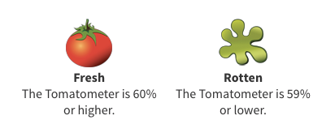

# Movie-Critic-Review-Web-App

Visit the website [here](https://tinyurl.com/y8lecjj4).

The purpose of the web application is to predict whether or not a text-based movie review is positive (i.e. fresh) or negative (i.e. rotten) based on Rotten Tomatoes; a popular review-aggregation website for film and television. It is an extension of a [mini-project](https://github.com/dtse91/Springboard/blob/master/Machine%20Learning/Naive%20Bayes/Mini_Project_Naive_Bayes.ipynb) prototyped in Jupyter Notebook using a Naive Bayes model. The Flask web application is hosted on the Google Cloud Platform. 

A movie's "freshness" is based on:

  

